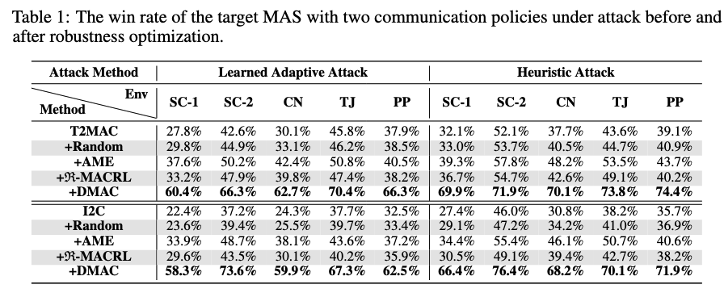

# <font size=6>DMAC</font>
This repository contains data and code for the paper 《Robust Multi-agent Communication Based on Decentralization-Oriented Adversarial Training》

# Overview

Borrow from the idea of `fighting fire with fire', we propose DMAC which employs the adversarial training strategy to enable the training of more robust communication policies capable of resisting potential adversarial attacks. 

We make experimental evaluation of effectiveness of DMAC on four environments (StarCraft II, Coop Navi, Predator-Prey, Traffic Junction) with promising performance, outperforming the SOTA baseline.

The overall structure is shown in the figure below:


The key step is identifying the critical communication channels, which is shown in the figure below:


# Environment Setup
## Installation instructions


Install Python packages for four envs:


```shell
# For StarCraft II
conda create -n MAS_Com python=3.8
conda activate MAS_Com

bash install_dependecies.sh
bash install_sc2.sh
```

```shell
# For Coop Navi and Predator-Prey
conda create -n MAS_Coo python=3.6.5
conda activate MAS_Coo

pip install torch == 1.1.0
git clone https://github.com/openai/multiagent-particle-envs.git
cd multiagent-particle-envs
pip install -e .

```

```shell
# For Traffic Junction
conda create -n MAS_TJ python=3.6.5
conda activate MAS_TJ

pip install -r requirements.txt

```

## Command Line Tool

**Run an experiment**

```shell
$ python3 main.py --map=1c3s5z --evaluate=True --load_model=True
```

# Results

### 1. Robustness`


### 2. Performance`


### 3. Decentralization`


# Reference
- https://github.com/oxwhirl/smac
- https://github.com/hijkzzz/pymarl2/
- https://github.com/openai/multiagent-particle-envs
- https://github.com/openai/maddpg